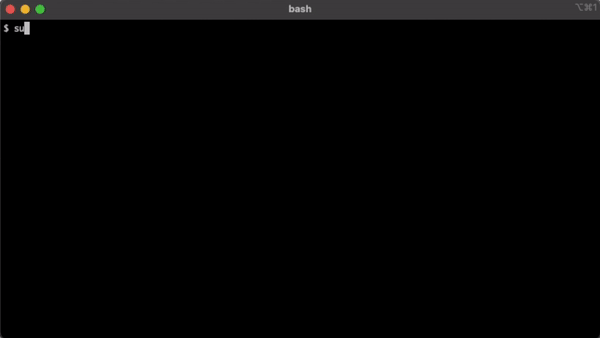
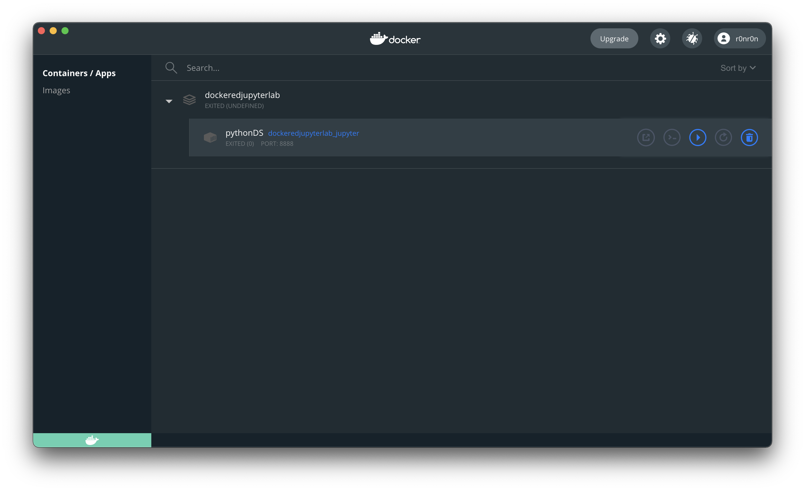
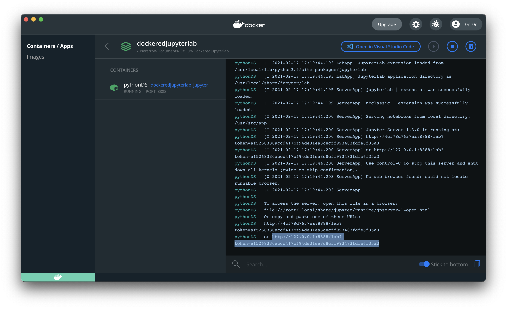
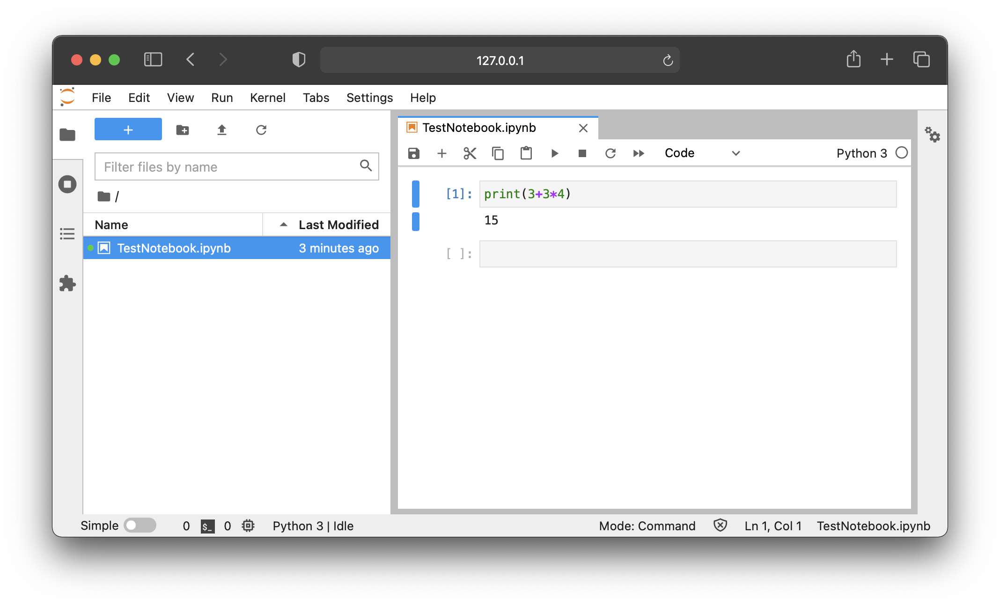
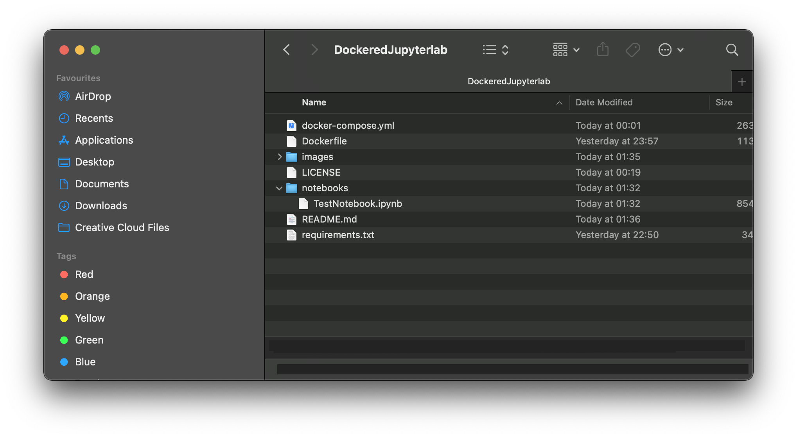

# Jupyterlab in a Docker Container
This is a template for building a development environment for Python with Jupyter Lab and , Numpy, Pandas and Matplotlib.

### Prerequisite
Install docker and docker-compose
* https://docs.docker.com/get-docker/
* https://docs.docker.com/compose/install/

### Initial use
Initial configuration will install Jupyter Lab and , Numpy, Pandas and Matplotlib. If you need more you can add it at **requirements.txt**.

Open a command line then execute this command:
```
sudo docker-compose up
```
*note : If you are not using mac or linux, remove **sudo**.*



Once done, open the URL on your browser. The url will look like something like this:
```
http://127.0.0.1:8888/lab?token=791b3a7b1384100f39efe063e47b68d03647fa90ff8ba614
```

<br />

### Succeeding Usage

You can also start stop the docker images from dashboard. Just look for the container you have just created and click the play button.


The URL keeps changing on every start of the docker image. You can check the the new URL by double-clicking the container from the dashboard to see the status.




All created notebooks will be created at your local directory **notebooks**.





<br />

### Copyright
Licensed under The MIT License (MIT). See LICENSE.md for more info.